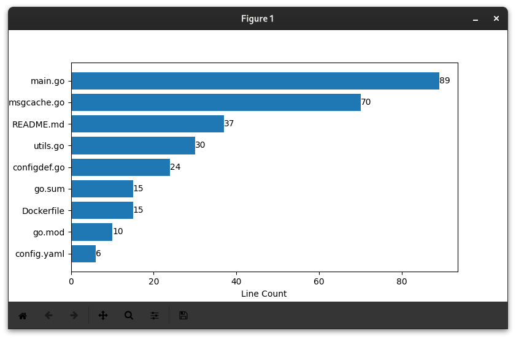

# Code Metrics

## What it does

This program displays metrics for given files or folders.

```
~$ python3 code-metrics.py ../IRC/Bots/uptodatebot

*** ../IRC/Bots/uptodatebot/ ***
Contains 10 items

|    
|    *** ../IRC/Bots/uptodatebot/src ***
|    Contains 3 items
|    
|    |    
|    |    *** ../IRC/Bots/uptodatebot/src/configdef ***
|    |    Contains 1 items
|    |    
|    |    |    
|    |    |    --- ../IRC/Bots/uptodatebot/src/configdef/configdef.go ---
|    |    |    Type: ASCII text
|    |    |    Line count: 24
|    |    |    Size: 452.00 B
|    |    |    
|    |    
|    |    *** ../IRC/Bots/uptodatebot/src/utils ***
|    |    Contains 1 items
|    |    
|    |    |    
|    |    |    --- ../IRC/Bots/uptodatebot/src/utils/utils.go ---
|    |    |    Type: ASCII text
|    |    |    Line count: 30
|    |    |    Size: 464.00 B
|    |    |    
|    |    
|    |    *** ../IRC/Bots/uptodatebot/src/msgcache ***
|    |    Contains 1 items
|    |    
|    |    |    
|    |    |    --- ../IRC/Bots/uptodatebot/src/msgcache/msgcache.go ---
|    |    |    Type: ASCII text
|    |    |    Line count: 70
|    |    |    Size: 1.64 KiB
|    |    |    
|    
|    
|    --- ../IRC/Bots/uptodatebot/main.go ---
|    Type: Go source, ASCII text
|    Line count: 89
|    Size: 2.25 KiB
|    
|    
|    --- ../IRC/Bots/uptodatebot/Dockerfile ---
|    Type: ASCII text
|    Line count: 15
|    Size: 419.00 B
|    
|    
|    --- ../IRC/Bots/uptodatebot/uptodatebot ---
|    Type: ELF 64-bit LSB executable, x86-64, version 1 (SYSV), dynamically linked
|    Size: 3.34 MiB
```



## Why we wanted to write this

Keeping track of files can be difficult. We wanted to make the task a little easier by adding graphics to help visualize folder structure and file size.

## How we collaborated

In order to stay synchronized while working at different times, we chose to use the industry standard [`git`](https://git-scm.org) version control system.
As we finished making our individual changes, we would commit and push our code to [GitHub](https://github.com/Pippadi/code-metrics), where we chose to host our repository.

Additionally, we strove to keep our code clean and understandable, with some comments as well.
How successful our efforts were in this regard is left to the evaluator.

## How it works

The program gets the file/folder whose details are required from command line arguments given in `sys.argv`.

If the given entity is a file, its details are printed directly. If it is a folder, the program iterates through its contents recursively, displaying details for each entity within it.

File details are consolidated into a class, of which an instance can be created for each file in question.
The class abstracts out the actual file handling code from the rest of the program.

For determining file type, the [`python-magic`](https://pypi.org/project/python-magic/) library is used.
It provides a simple way to get the [MIME type](https://developer.mozilla.org/en-US/docs/Web/HTTP/Basics_of_HTTP/MIME_types).
Depending on whether the MIME type contains "text", the contents (as characters or raw bytes) are read to a buffer.
From there, metrics like line count (number of newline characters) or file size can be calculated.

If a directory is specified, the program also displays a graph of the number of lines of each of the top 10 longest files.
Graphing is done with the [`matplotlib`](https://matplotlib.org/) library.
To assemble the data required, a hash map (dictionary) is created with filenames as keys and their line counts as their values.
From there, the keys and values are taken into separate arrays, and sorted by line count.
Finally, the top 10 longest files are taken, and fed to `matplotlib` to plot.


## The MYSQL Part of the Project
So no we come to the MYSQL part of this program!
We have created a python program connecting to MYSQL that allows users to add or remove users from our database.
Now for this they will need thier ID and Password! Which we have added for some users already, technically for the ones who have created this. XD
Now its us who decide who we want to give access to and not to. So now we move on to the first part of the program that creates a user in our database.
We have used functions and Arguments in our following program to make this a bit easier for us.
# Part 1
So how do we create a USER in our database??
We know that we cannot directly create user in our database becouse we first have to connect to our MYSQL database by the use of the mysql.connector.
We import mysql.connector as cor and then begin with our code:
1. So we start by defining a function create with arguments name and password that will help the users to add new users to the database.
2. Then we connect to our database we want to add the users to.
3. Then we create a cursor that will help the user to execute the commands into the database.
4. Finally we add in our SECRET line of code that helps the users actually add new users into the database.
5. We finally Commit these changes in our SQL by using sql.commit()
6. The final step is that we test our program by running it to check weather it works.............
BINGO! It does.

So now we have seen how do we create Users into the database, Now let us move onto how to Delete/Remove users from our databases.

# Part 2
So insted of starting this part with the same old sentence, How about................
We jump straight to the action?
Just for the information, we wouldn't need to import mysql.connector again because this program was written in the same place as the Create user one.
These were the words of a Italian Plumber...... Let's A'go!
1. We again start by defining a function delete with argument name which will help the users to remove access of those users who are no longer required.
2. Then we again connect to our database to make changes to it i.e to remove users.
3. We Create a cursor again to help the user execute the command they want to
NOTE: We will connect to the specific database and create a cursor everytime in the following programs as these are seprate functions.
4. And again comes our magic code line that does the job quiet rigth for us.
5. Don't forget to commit the changes to the database by using sql.commit()
6. Does it work??
Of course it does! 

So now we move on to the final part of the program.
What is it about anyway?
You will get to know about that in part 3 HEHE!
The only HINT is:
How will the users will carry out the above operations in the first place??

# Part 3
So You are finally here!
Glad you made it till the end:)
So time to lift the suspense!
So our last job is to AUTHORIZE the users so they can make any sort of changes they want to make in the Database
So why wait?, let's Jump Right In!
1. We define the function authorize and the arguments name and password.
2. We connect to the database, create a cursor and then continue.
3. We add our magic touch i.e our special code line that helps us authorize the users and execute the entered value and check for it's existence in the database.
4. Then we add a boolean statment which will return us True if the value exists and False if doesn't.
5. Finally we test our block of code and guess what? .........................
BOYAAH! It works.

So That was all to our MYSQL part of the Project.
And i am out of words! XD
Thank You 

